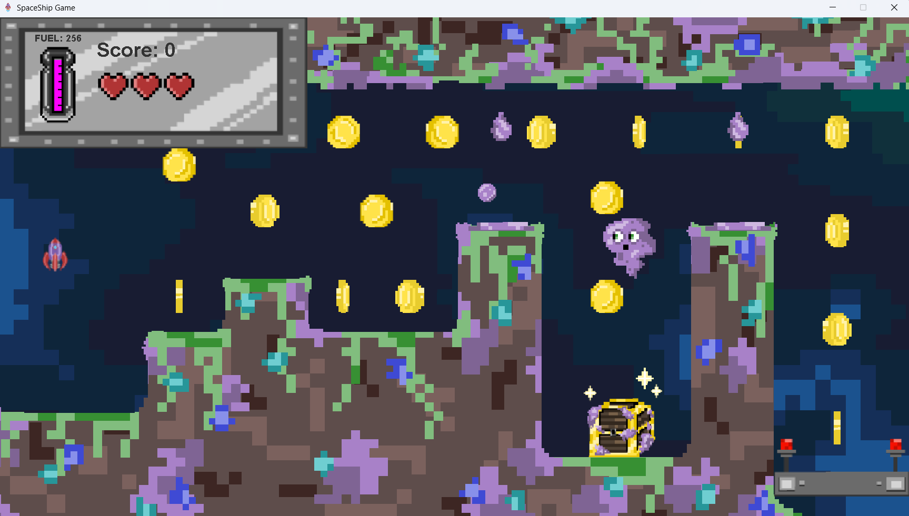
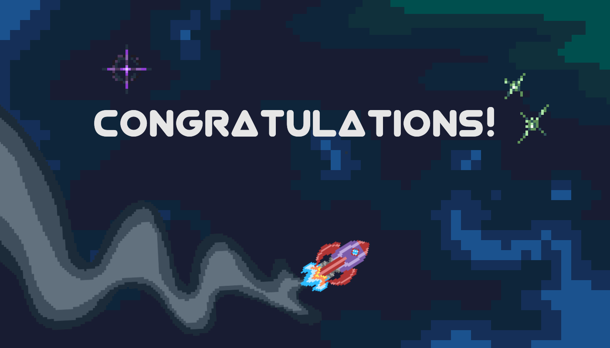

                                                                                  
# Welcome to Drip World

*Art*: Mina Stevens 
*Coding*: Tiago Davies

## Coding
Refractored codebase I wrote in Freshman year. New code has better OOP and also features better design principles such as composition over inheritance (in the gameobject design), and single responsibility classes. In the future the flyweight pattern could be applied to the coin animation array to save memory.

## Build Instructions:
Compile **ALL** classes and Run the Main.java  
javac -d bin *.java  
java -cp bin Main

## Controls:
Press [s] to start. 
Use the arrow keys (or WASD) to control the spaceship.

## Objective
The objective is to land on the landing platform perfectly straight.
Landing sideways or slightly slanted will cause a crash and respawn.

